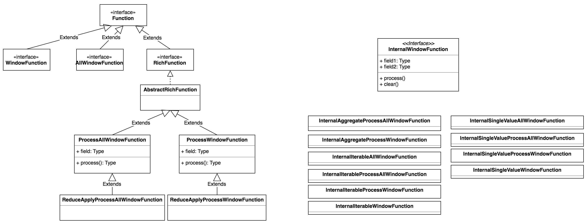
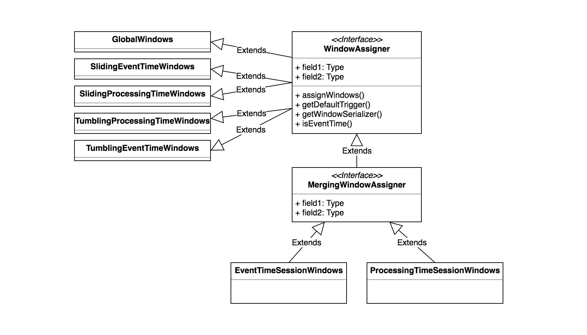
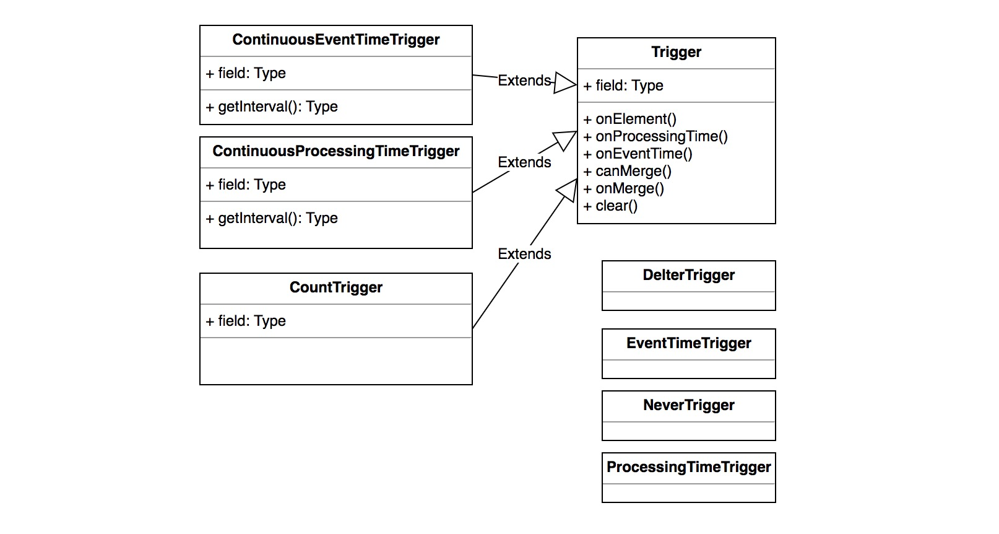
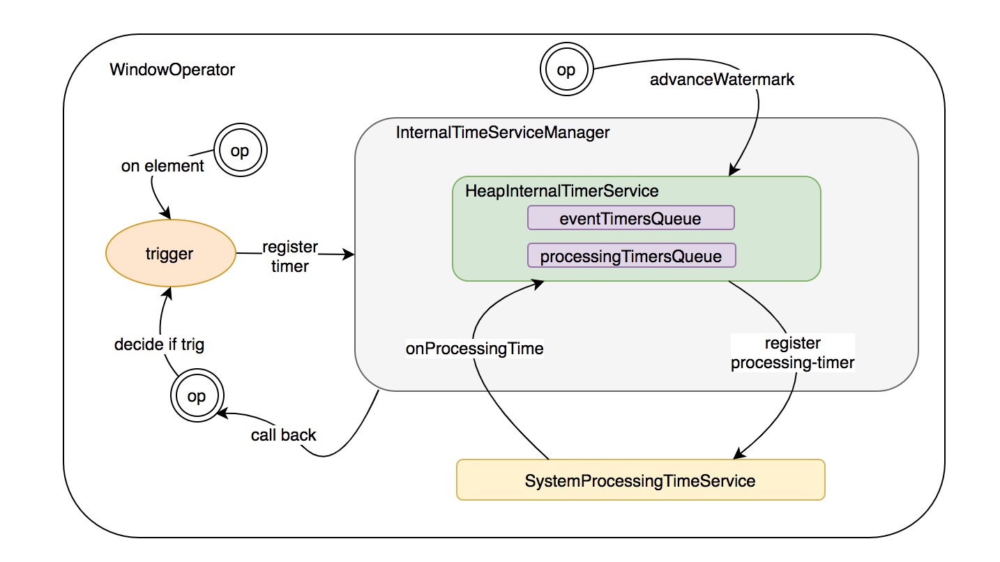
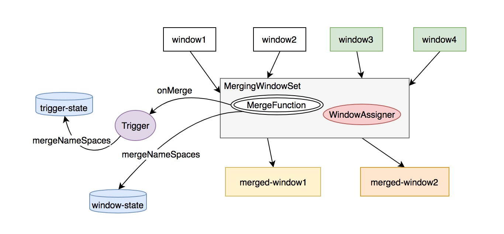

## 前言

窗口计算是流式计算里比较常见的场景，不同的计算框架在解决窗口计算方面提出了自己的思路，storm 目前还停留在内存计算的基础上，并且尚不支持事件时间滑动；spark-streaming 通过 struct-streaming 实现了事件/处理 时间的精确窗口计算，借助 rdd 的特性很好的保证了窗口计算的精确性；flink 在 data-flow 模型的设计前提下，友好的支持了事件/处理时间的窗口触发，同时借助分布式的状态存储，为窗口中间结果保存提供了较好的扩展性支持

## 核心抽象

这部分会介绍围绕 WindowOperator 的核心抽象，主要涉及窗口计算中的一些核心角色

### Window

Window 代表一个有限的元素集合，并且由多个 窗格/pane 组成，一个窗口有一个 maximux timestamp，代表某个时刻所有的窗口元素都已到达。窗口的实现有两个：

- TimeWindow: 具有时间窗口属性的窗口，会维护一个起始和终止时间
- GlobalWindow: 没有起始/终止时间的限制，所有的元素都会进一个窗口

### WindowFunction

在 Trigger 触发的时候，调用的函数，WindowFunction 接口有抽象实现 `RichWindowFunction`，用来提供对运行时环境 RuntimeContext 的访问及 `open()` `close()` 这样的生命周期管理方法

按照是否按照grouping key 来处理窗口元素，WindowFunction 可以被分为两类：

- ProcessAllWindowFunction/AllWindowFunction: 每次处理 window 内所有元素
- ProcessWindowFunction/WindowFunction: 每次处理一个窗格/pane

继承关系如下：

flink 内部在计算的时候使用的是 InternalWindowFunction，在基础 function 的基础上封装了一些运行时环境和配置。

### WindowAssigner

一个 WindowAssigner 主要将一个或多个 window 抽象派发给一个元素/消息，在一次 window 的操作中，窗口内的元素会被按照它对应的 key 以及分配的 window 做 group by，一个 key + window 对应的元素集被称作一个窗格/pane。当一个触发器/Trigger 决策出某个 pane 应该触发对应的窗口函数/WindowFunction 时，窗口函数会被应用到 pane 的元素集上输出结果元素

#### WindowAssigner 的核心接口

- assignWindows: 将对应的 window/windows 分配给指定的元素
- getDefaultTrigger: 获取指定的 Trigger
- isEventTime: 是否基于 event time 将 window/windows 分配给元素

#### WindowAssigner 的实现

WindowAssigner 的实现可以按照几个维度来划分，具体继承关系如下图：

可以看到一些特性：

- session 类型的窗口对应的 WindowAssigner 是可以被 merge 的，其它不可以
- sliding window 对应的 assigner 分配的 windows 间是可以覆盖的

### Trigger

Trigger 决定了一个窗格 pane 中的元素触发计算窗口函数的时机，按照上面对 WindowAssigner 的描述，一个元素可以被分到多个 window，按照 key-window 做 grouping 的元素集组成一个 pane，每个 pane 都有自己的 Trigger 实例。Trigger 管理了 event-timer/processing-timer 的注册；同时在处理元素以及对应的 timer event 在 WindowOperator 上触发时*决策*是否真正触发计算[ FIRE/CONTINUE ]

#### Trigger 的核心接口

- onElement: 处理每个添加到 pane 中的元素
- onEventTime: TriggerContext 注册的 event-time timer 被触发时调用
- onProcessingTime: TriggerContext 注册的 processing-time timer 被触发时调用
- onMerge: window 被 merge 时触发

Trigger 内部定义了 TriggerContext 抽象，用来管理 event/processing-time timer 的注册和状态存储

#### Trigger 的实现

继承关系如下图:

典型的 trigger 实现用途：

- ContinuousEventTimeTrigger：指定的 interval 以及 event window 的边界小于当前 watermark 时触发 onEventTime 计算
- ContinuousProessingTimeTrigger：指定的 interval 触发 onProcessingTime 计算
- CountTrigger: 指定的 maxCount 触发，出发后 maxCount 清零重新累加
- DeltaTrigger: 提供 delta 函数和历史 datapoint 存储，每个元素消费时触发 delta 函数计算
- EventTimeTrigger：event window 的边界小于当前 watermark 时触发 onEventTime 计算
- ProessingTimeTrigger：event window 的边界小于当前 watermark 时触发 onProcessingTime 计算

### WindowOperator

WindowOperator 是窗口计算算子的核心抽象，使用上面描述的 WindowAssigner 和 Trigger 来完成窗口计算。当一个元素到达时，会通过 KeySelector 分配一个 key，并且通过 WindowAssigner 将该元素分配到多个窗口，也就是多个 pane，后 Trigger 会决策 pane 中的元素被 fire 窗口计算的时机，这里调用的函数为 InternalWindowFunction。我们用一张图来描述这种组成关系：

#### WindowOperator 时间事件触发管理

我们都知道流式计算中对于计算时间主要分为两类：event-time、processing-time，对不同的时间类型，在引擎的内部需要一套管理时间事件触发的机制，典型的 processing-time 按照 interval 定时触发[ 或及时触发单不一定精准 ]，event-time 按照特定的事件触发。
在 flink 内部，由以下抽象来管理时间事件的触发：

- InternalTimer: 内部代表一个 timer，封装了对应的 key 、namespace[ 关于 key, namespace 的概念会在分布式快照/StateBackend 设计的部分介绍，这里只需了解，key 代表 timer 触发时的活跃元素 key，namespace 代表特定的窗口，通过 key-namespace 的组合可以唯一确定一个 pane/窗格，触发计算 ] 以及 timestamp，
- InternalTimeService: 用来管理 time 以及相应的 timer，会提供注册/销毁 event-timer/ processing-timer 的接口以及获取当前 processing-time、watermark 的接口，同时会通过回调接口触发相应的 event-time/processing-time 回调。目前的唯一实现是 HeapInternalTimerService，其在堆中维护了两个队列分别存储已注册的 event-timer 和 peocessing-timer
- InternalTimeServiceManager: 用来管理 TaskManager 中所有一个算子的 InternalTimeService，算子可以使用 name 属性申请不同的 InternalTimeService
- ProcessingTimeService：从 StreamTask 中传递过来的管理 processing-timer 注册和回调的服务

------

它们之间的关系可以用下图来解释：

**事件注册/触发流程**

- **event-time event**: 每个窗格pane[或者 key-window pair] 的 event timer 通过
  -> `WindowOperator.processElement()`
  -> `Trigger.onElement()`
  -> `InternalTimeService.registerProcessingTimeTimer()` 来注册；
  通过
  -> `WindowOperator.processElement()`
  -> `Trigger.onElement()`
  或者
  -> `InternalProcessingTimeService.TriggerTask.run()`
  -> `InternalTimeService.onProcessingTime()`
  -> `WindowOperator.onProcessingTime()`
  -> `Trigger.onProcessingTime()` 来触发
- **processing-time event**: 每个窗格pane[或者 key-window pair] 的 processing-time timer 通过
  -> `WindowOperator.processElement()`
  -> `Trigger.onElement()`
  -> `InternalTimeService.registerEventTimeTimer()` 来注册；
  通过
  -> `WindowOperator.processElement()`
  -> `Trigger.onElement()`
  或者
  -> `AbstractStreamOperator.processWatermark()`
  -> `InternalTimeServiceManager.advanceWatermark()`
  -> `InternalTimeService.advanceWatermark()`
  -> `WindowOperator.onEventTime()` 来触发

*ps: 这里的 InternalTimeServiceManager 在运行时是 operator 粒度，也就是 task 粒度的实例*

#### WindowOperator 窗口状态的更新和计算触发

上面已经梳理了窗口事件触发的时机，进一步，触发了窗口事件后，会开始窗口结果查询并传递给 InternalWindowFunction，来触发一次窗口的函数计算，并最终将结果输出到下游算子，窗口的内容在 `WindowOperator.processElement()` 中更新，在 `WindowOperator.onEventTime()` 和 `WindowOperator.onProcessingTime()` 中触发窗口计算
**窗口值更新过程**

- 在处理每个消息元素时，通过 WindowAssigner 计算元素需要分到什么样时间跨度的 window 里，对于每个分到的 window，会将本次的消息元素追加到 window 对应的 value 结果中，并会调用 `Trigger.onElement()` 检测是否触发了窗口事件，如果触发，取出对应的 value 结果，触发窗口计算
- 如果 WindowAssigner 是具有合并窗口的属性[ session窗口 ]，会将划分出的窗口逐一添加到一个名为 MergingWindowSet 的工具类[ 内部会触发 namespace/window 对应的 value 合并 以及 trigger 触发时间属性的合并，下面会专门讲解 ]

**窗口计算触发**
*这里只介绍 event-time 事件触发，processing-time 事件类似*

- 取出 event-timer 对应的 window 的 value 结果[ 一个窗格的累加值 ]，调用 `Trigger.onEventTime()`检测是否触发了窗口事件，如果触发，取出对应的 value 结果，触发窗口计算，值得注意的是: InternalTimeService 在将 event-timer 事件发送给 WindowOperator 的时候会同时设置 event-timer 窗口的活跃 key[ 前面提到过一个 key 和 window 可以唯一确定一个 pane ]
- 如果 window 已经过期，将对应的 value 结果清理掉

#### WindowOperator 可合并窗口的更新和计算

*可合并窗口的管理会稍微复杂一些，这里单独介绍*
窗口的合并由一个辅助工具类 MergingWindowSet 来完成，它维护了一个 window -> state-window 的映射关系，什么叫 state-window 呢？它其实是可合并的窗口的唯一的 namespace，用来作为存储合并窗口 value 结果的依据，前面提到 key-window 会作为一个 pane value 结果存储结果的唯一标识，state-window + 触发的活跃 key 可以唯一确定一个合并后窗口里的计算窗格
除了合并窗口的时间边界，合并窗口的关键在于状态的合并，这里有两个角色维护了需要合并的状态：

- Trigger: 部分 trigger 自己维护了一些状态，比如下次触发时间等
- WindowOperator: 窗口算子的 value 结果

Flink 使用 State/状态存储 来保存状态，在窗口合并时，只需将多个窗口的存储状态合并即可，对应的是 InternalMergingState 的 mergeNamesspaces 操作[ Flink 使用 InternalXXXState 来管理算子内部的 active key，活跃 key 的变动对用户透明 ]

MergingWindowSet 内部将 WindowAssigner 分配的窗口合并后，通过回调函数 MergeFunction 来触发状态的合并

附一张图解释这个过程：

在 MergingWindowSet 中维护了每个 window 和对应的 state-window 的对应关系，当触发 window 的窗口计算时，先找到对应的 state-window，取出对应的状态作为该窗口对应的状态结果

### WindowStream

WindowStream 暴露了一些常用的流处理接口，生成对应的 WindowOperator，这里就不赘述了[ 之前的博客 flink 逻辑计划生成部分详细讲解了 DataStream 和 Operator 之间的关系 ]

## WindowOperator 的快照和恢复

WindowOperator 的状态恢复包括三部分：用户函数 UDF 的计算状态、窗口计算结果/window-state 以及触发 timers

udf 的快照和恢复封装在 WindowOperator 的父类 AbstractUdfStreamOperator 中，

- udf快照：flink 将 snapshotState 接口暴露给用户，用户可自行时间快照逻辑，flink 拿到快照后将其序列化存储到状态存储
- udf恢复：直接反序列化状态存储并调用 udf 的 restoreState 接口将状态恢复

window-state 以及 trigger 的状态快照/恢复由 AbstractStreamOperator 来管理[ window-state 的状态又包括 keyed/非 keyed/opsrator-state 三部分，之后的博客会专门讲分布式快照设计 ]

timers 的恢复在 AbstractStreamOperator 做 snapshot 的时候一起完成，底层是通过 InternalTimeServiceManager 来实现

这一块儿的设计有一个小的 trick，在 AbstractStreamOperator 内部，统一的快照走
`snapshotState(long checkpointId, long timestamp, CheckpointOptions checkpointOptions)` 接口，其内部会调用另一个接口：`snapshotState(StateSnapshotContext context)`，
这个接口默认实现了 InternalTimeServiceManager 的 timers 的快照，继承了 AbstractStreamOperator 的子类可以继承这个接口完成额外的状态快照，丰富自己的功能，比如 AbstractUdfStreamOperator 就在默认 timers 快照的基础上，又快照了 udf 的状态
恢复的的策略类似，子类可以重载 `initializeState(StateInitializationContext context)` 来实现自己的恢复策略