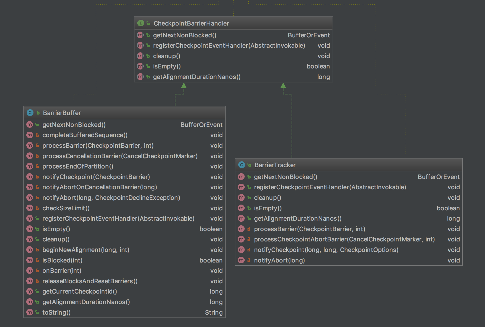

## CheckpointBarrierHandler

这个handler用于react从input channel过来的checkpoint barrier，这里可以通过不同的实现来，决定是简单的track barriers，还是要去真正的block inputs
    

### CheckpointBarrierHandler接口类的两个实现:

BarrierBuffer  对应于Exactly Once

BarrierTracker  对应于At Least Once

### CheckpointBarrierHandler的主要接口方法：

    /**
     * The CheckpointBarrierHandler reacts to checkpoint barrier arriving from the input channels.
     * Different implementations may either simply track barriers, or block certain inputs on
     * barriers.
     */
    public interface CheckpointBarrierHandler {
    
        /**
         * Returns the next {@link BufferOrEvent} that the operator may consume.
         * This call blocks until the next BufferOrEvent is available, ir until the stream
         * has been determined to be finished.
         * 
         * @return The next BufferOrEvent, or {@code null}, if the stream is finished.
         * @throws java.io.IOException Thrown, if the network or local disk I/O fails.
         * @throws java.lang.InterruptedException Thrown, if the thread is interrupted while blocking during
         *                                        waiting for the next BufferOrEvent to become available.
         */
        BufferOrEvent getNextNonBlocked() throws IOException, InterruptedException;
    
        /**
         * Registers the given event handler to be notified on successful checkpoints.
         * 
         * @param checkpointHandler The handler to register.
         */
        void registerCheckpointEventHandler(EventListener<checkpointbarrier> checkpointHandler);
    
        /**
         * Cleans up all internally held resources.
         * 
         * @throws IOException Thrown, if the cleanup of I/O resources failed.
         */
        void cleanup() throws IOException;
    
        /**
         * Checks if the barrier handler has buffered any data internally.
         * @return True, if no data is buffered internally, false otherwise.
         */
        boolean isEmpty();
    }&nbsp;


## BarrierBuffer

其核心就是一个input channel收到barrier，立刻阻塞，然后判断是否收到所有input channel的barrier，如果全部收到，则广播出barrier，触发此task的检查点，并对阻塞的channel释放锁。

实际上，为了防止输入流的背压（back-pressuring），BarrierBuffer并不是真正的阻塞这个流，而是将此channel中，barrier之后数据通过一个BufferSpiller来buffer起来，当channel的锁释放后，再从buffer读回这些数据，继续处理。

    /**
     * The barrier buffer is {@link CheckpointBarrierHandler} that blocks inputs with barriers until
     * all inputs have received the barrier for a given checkpoint.
     * 
     * <p>To avoid back-pressuring the input streams (which may cause distributed deadlocks), the
     * BarrierBuffer continues receiving buffers from the blocked channels and stores them internally until 
     * the blocks are released.</p>
     */
    public class BarrierBuffer implements CheckpointBarrierHandler {
        
        /** The gate that the buffer draws its input from */
        private final InputGate inputGate; //一个task对应一个InputGate，代表input的数据集合（可能来自不同的input channel）
    
        /** Flags that indicate whether a channel is currently blocked/buffered */
        private final boolean[] blockedChannels; // 标记每个input channel是否被阻塞（或者叫被buffer）
    
        /** The total number of channels that this buffer handles data from */
        private final int totalNumberOfInputChannels; // input channel的数量，可通过InputGate获得
    
        /** To utility to write blocked data to a file channel */
        private final BufferSpiller bufferSpiller; // 将被阻塞的input channel的数据写到buffer
    
        /** The pending blocked buffer/event sequences. Must be consumed before requesting
         * further data from the input gate. */
        private final ArrayDeque<BufferSpiller.SpilledBufferOrEventSequence> queuedBuffered; // barrier到达时，此operator中在之前buffered的数据要消费掉
    
        /** The maximum number of bytes that may be buffered before an alignment is broken. -1 means unlimited */
        private final long maxBufferedBytes; // 最多允许buffer的字节数，-1代表无限制
    
        /** The sequence of buffers/events that has been unblocked and must now be consumed
         * before requesting further data from the input gate */
        private BufferSpiller.SpilledBufferOrEventSequence currentBuffered; // 已经buffer的数据
    
        /** Handler that receives the checkpoint notifications */
        private StatefulTask toNotifyOnCheckpoint; // 通知检查点进行
    
        /** The ID of the checkpoint for which we expect barriers */
        private long currentCheckpointId = -1L; // 当前检查点ID
    
        /** The number of received barriers (= number of blocked/buffered channels)
         * IMPORTANT: A canceled checkpoint must always have 0 barriers */
        private int numBarriersReceived; // 接收到的barrier的数量，这个值最终要等于buffered channel的数量。当一个检查点被cancel时，此值为0
    
        /** The number of already closed channels */
        private int numClosedChannels; // 已经关闭的channel的数量
    
        /** The number of bytes in the queued spilled sequences */
        private long numQueuedBytes; // spill到队列中的数据的字节数
    
        /** The timestamp as in {@link System#nanoTime()} at which the last alignment started */
        private long startOfAlignmentTimestamp; // 上一次对齐开始时的时间戳
    
        /** The time (in nanoseconds) that the latest alignment took */
        private long latestAlignmentDurationNanos; // 最近一次对齐持续的时间
    
        /** Flag to indicate whether we have drawn all available input */
        private boolean endOfStream; // 标记是否流结束（所有的input已经收到barrier，标记检查点完成）


### InputGate

每个task都会对应有一个InputGate，目的是专门处理流入到此task中的所有的输入信息，这些输入可能来自多个partition。

详见InputGate的javadocs


### BarrierBuffer.getNextNonBlocked

Buffer and barrier handling

    @Override
    public BufferOrEvent getNextNonBlocked() throws IOException, InterruptedException {
        while (true) {
            // process buffered BufferOrEvents before grabbing new ones
            BufferOrEvent next;
            if (currentBuffered == null) { //如果currentBuffered为空，说明没有unblock的buffer数据，直接从inputGate读取
                next = inputGate.getNextBufferOrEvent();
            }
            else {
                next = currentBuffered.getNext(); //从currentBuffered读
                if (next == null) {  //如果读到的为空，说明currentBuffered已经为空
                    completeBufferedSequence(); //清空当前的currentBuffered，看看queuedBuffered中还有没有需要处理的buffer
                    return getNextNonBlocked();// 递归调用，此时currentBuffered如果为null，则queuedBuffered也为null；否则如果currentBuffered不为null，说明还要继续处理queuedBuffere中的数据
                }
            }
            
            if (next != null) {
                if (isBlocked(next.getChannelIndex())) { //如果这个channel还是被阻塞，则继续把这条record添加到buffer中
                    // if the channel is blocked we, we just store the BufferOrEvent
                    bufferSpiller.add(next); //那么我们只是把这个BufferOrEvent放到bufferSpiller里面
                }
                else if (next.isBuffer()) { //如果没有被block，就处理该条数据，如果是buffer即真实数据，那么直接返回该数据
                    return next;
                }
                else if (next.getEvent().getClass() == CheckpointBarrier.class) { //如果是CheckpointBarrier
                    if (!endOfStream) {
                        // process barriers only if there is a chance of the checkpoint completing
                        processBarrier((CheckpointBarrier) next.getEvent(), next.getChannelIndex()); //那么调用processBarrier，后面具体分析
                    }
                }
                else {
                    if (next.getEvent().getClass() == EndOfPartitionEvent.class) {
                        numClosedChannels++;
                        // no chance to complete this checkpoint
                        releaseBlocks(); //因为某个channel close了，那就永远也无法从这个channel获取barrier了，所以releaseBlocks
                    }
                    return next;
                }
            }
            else if (!endOfStream) {
                // end of stream. we feed the data that is still buffered
                endOfStream = true;
                releaseBlocks();//流结束了，所以也需要releaseBlocks
                return getNextNonBlocked();
            }
            else {
                return null;
            }
        }
    }

&nbsp;

### BarrierBuffer.processBarrier

​    这个方法中，当收到barrier后，立刻进行processBarrier()的处理，这也是其核心所在

    	private void processBarrier(CheckpointBarrier receivedBarrier, int channelIndex) throws Exception {
    		final long barrierId = receivedBarrier.getId();
    
    		// fast path for single channel cases
    		if (totalNumberOfInputChannels == 1) { // 如果总共的channel数量只有1，此时说明这个operator只有一个input
    			if (barrierId > currentCheckpointId) { //如果这个barrierId大于当前的检查点ID，则说明这个barrier是一个新的barrier
    				// new checkpoint
    				currentCheckpointId = barrierId;  //将这个barrierId赋给当前的检查点ID
    				notifyCheckpoint(receivedBarrier);  //触发检查点
    			}
    			return;
    		}
    
    		// -- general code path for multiple input channels --
    		if (numBarriersReceived > 0) { //如果已经收到过barrier
    			// this is only true if some alignment is already progress and was not canceled
    
    			if (barrierId == currentCheckpointId) {  // 判断此barrierId与当前的检查点ID是否一致
    				// regular case
    				onBarrier(channelIndex);  // 如果一直，则阻塞此channel
    			}
    			else if (barrierId > currentCheckpointId) { // 如果barrierId大于当前的检查点ID，则说明当前的检查点过期了，跳过当前的检查点
    				// we did not complete the current checkpoint, another started before
    				LOG.warn("Received checkpoint barrier for checkpoint {} before completing current checkpoint {}. " +
    						"Skipping current checkpoint.", barrierId, currentCheckpointId);
    
    				// let the task know we are not completing this
    				notifyAbort(currentCheckpointId, new CheckpointDeclineSubsumedException(barrierId)); // 通知task终止当前的检查点
    
    				// abort the current checkpoint
    				releaseBlocksAndResetBarriers();  // 释放所有channel的锁
    
    				// begin a the new checkpoint
    				beginNewAlignment(barrierId, channelIndex); // 根据barrierId，开始新的检查点
    			}
    			else {
    				// ignore trailing barrier from an earlier checkpoint (obsolete now)
    				return;
    			}
    		}
    		else if (barrierId > currentCheckpointId) { // 如果第一次收到的barrierID大于当前的检查点ID，说明是一个新的barrier
    			// first barrier of a new checkpoint
    			beginNewAlignment(barrierId, channelIndex); // 根据barrierId，开始新的检查点
    		}
    		else {
    			// either the current checkpoint was canceled (numBarriers == 0) or
    			// this barrier is from an old subsumed checkpoint
    			return;
    		}
    
    		// check if we have all barriers - since canceled checkpoints always have zero barriers
    		// this can only happen on a non canceled checkpoint
    		if (numBarriersReceived + numClosedChannels == totalNumberOfInputChannels) { //如果收到所有channel的barrier，说明走到了
    			// actually trigger checkpoint
    			if (LOG.isDebugEnabled()) {
    				LOG.debug("Received all barriers, triggering checkpoint {} at {}",
    						receivedBarrier.getId(), receivedBarrier.getTimestamp());
    			}
    
    			releaseBlocksAndResetBarriers();  // 释放所有channel的锁
    			notifyCheckpoint(receivedBarrier); // 触发检查点
    		}
    	}

&nbsp;

### BarrierBuffer.notifyCheckpoint

```
private void notifyCheckpoint(CheckpointBarrier checkpointBarrier) throws Exception {
        if (toNotifyOnCheckpoint != null) {
            CheckpointMetaData checkpointMetaData =
                    new CheckpointMetaData(checkpointBarrier.getId(), checkpointBarrier.getTimestamp());

            long bytesBuffered = currentBuffered != null ? currentBuffered.size() : 0L;

            checkpointMetaData
                    .setBytesBufferedInAlignment(bytesBuffered)
                    .setAlignmentDurationNanos(latestAlignmentDurationNanos);

            toNotifyOnCheckpoint.triggerCheckpointOnBarrier(checkpointMetaData);
        }
    }
```

toNotifyOnCheckpoint是个StatefulTask接口，管理每个task接收检查点的通知，其triggerCheckpoint方法是真正的实现。


### BarrierBuffer.releaseBlocksAndResetBarriers

 

    	/**
    	 * Releases the blocks on all channels and resets the barrier count.
    	 * Makes sure the just written data is the next to be consumed.
    	 */
    	private void releaseBlocksAndResetBarriers() throws IOException {
    		LOG.debug("End of stream alignment, feeding buffered data back");
    
    		for (int i = 0; i < blockedChannels.length; i++) {
    			blockedChannels[i] = false;
    		}
    
    		if (currentBuffered == null) {
    			// common case: no more buffered data
    			currentBuffered = bufferBlocker.rollOverReusingResources();
    			if (currentBuffered != null) {
    				currentBuffered.open();
    			}
    		}
    		else {
    			// uncommon case: buffered data pending
    			// push back the pending data, if we have any
    			LOG.debug("Checkpoint skipped via buffered data:" +
    					"Pushing back current alignment buffers and feeding back new alignment data first.");
    
    			// since we did not fully drain the previous sequence, we need to allocate a new buffer for this one
    			BufferOrEventSequence bufferedNow = bufferBlocker.rollOverWithoutReusingResources();
    			if (bufferedNow != null) {
    				bufferedNow.open();
    				queuedBuffered.addFirst(currentBuffered);
    				numQueuedBytes += currentBuffered.size();
    				currentBuffered = bufferedNow;
    			}
    		}
    
    		if (LOG.isDebugEnabled()) {
    			LOG.debug("Size of buffered data: {} bytes",
    					currentBuffered == null ? 0L : currentBuffered.size());
    		}
    
    		// the next barrier that comes must assume it is the first
    		numBarriersReceived = 0;
    
    		if (startOfAlignmentTimestamp > 0) {
    			latestAlignmentDurationNanos = System.nanoTime() - startOfAlignmentTimestamp;
    			startOfAlignmentTimestamp = 0;
    		}
    	}


### BarrierBuffer.bufferBlocker

/** To utility to write blocked data to a file channel. */
private final BufferBlocker bufferBlocker;

BufferBlocker： The buffer blocker takes the buffers and events from a data stream and adds them in a sequence.* After a number of elements have been added, the blocker can "roll over": It presents the added* elements as a readable sequence, and creates a new sequence.

两个实现类：

BufferSpiller 写入到文件

CachedBufferBlocker  （This buffer blocked can be used in credit-based flow control for better barrier alignment in exactly-once mode）


## BarrierTracker

因为不会去block input channel，所以无法实现exactly once，只能实现at-least once    
    
    /**
     * The BarrierTracker keeps track of what checkpoint barriers have been received from
     * which input channels. Once it has observed all checkpoint barriers for a checkpoint ID,
     * it notifies its listener of a completed checkpoint.
     *
     * <p>Unlike the {@link BarrierBuffer}, the BarrierTracker does not block the input
     * channels that have sent barriers, so it cannot be used to gain "exactly-once" processing
     * guarantees. It can, however, be used to gain "at least once" processing guarantees.
     *
     * <p>NOTE: This implementation strictly assumes that newer checkpoints have higher checkpoint IDs.
     */
    public class BarrierTracker implements CheckpointBarrierHandler {
    
    @Override
    	public BufferOrEvent getNextNonBlocked() throws Exception {
    		while (true) {
    			Optional<BufferOrEvent> next = inputGate.getNextBufferOrEvent();
    			if (!next.isPresent()) {
    				// buffer or input exhausted
    				return null;
    			}
    
    			BufferOrEvent bufferOrEvent = next.get();
    			if (bufferOrEvent.isBuffer()) { //如果是数据就直接返回
    				return bufferOrEvent;
    			}
    			else if (bufferOrEvent.getEvent().getClass() == CheckpointBarrier.class) {
    				processBarrier((CheckpointBarrier) bufferOrEvent.getEvent(), bufferOrEvent.getChannelIndex());  //如果是barrier就处理
    			}
    			else if (bufferOrEvent.getEvent().getClass() == CancelCheckpointMarker.class) {
    				processCheckpointAbortBarrier((CancelCheckpointMarker) bufferOrEvent.getEvent(), bufferOrEvent.getChannelIndex());
    			}
    			else {
    				// some other event
    				return bufferOrEvent;
    			}
    		}
    	}
    	
    	private void processBarrier(CheckpointBarrier receivedBarrier, int channelIndex) throws Exception {
    		final long barrierId = receivedBarrier.getId();
    
    		// fast path for single channel trackers
    		if (totalNumberOfInputChannels == 1) {
    			notifyCheckpoint(barrierId, receivedBarrier.getTimestamp(), receivedBarrier.getCheckpointOptions());
    			return;
    		}
    
    		// general path for multiple input channels
    		if (LOG.isDebugEnabled()) {
    			LOG.debug("Received barrier for checkpoint {} from channel {}", barrierId, channelIndex);
    		}
    
    		// find the checkpoint barrier in the queue of pending barriers
    		CheckpointBarrierCount cbc = null;
    		int pos = 0;
    
    		for (CheckpointBarrierCount next : pendingCheckpoints) { //找找看，这个barrier是否直接收到过
    			if (next.checkpointId == barrierId) {
    				cbc = next;
    				break;
    			}
    			pos++;
    		}
    
    		if (cbc != null) { //如果收到过
    			// add one to the count to that barrier and check for completion
    			int numBarriersNew = cbc.incrementBarrierCount(); //计数加一
    			if (numBarriersNew == totalNumberOfInputChannels) { //判断是否所有的barrier已经到全了
    				// checkpoint can be triggered (or is aborted and all barriers have been seen)
    				// first, remove this checkpoint and all all prior pending
    				// checkpoints (which are now subsumed)
    				for (int i = 0; i <= pos; i++) {
    					pendingCheckpoints.pollFirst(); //当一个checkpoint被触发时，prior的所有checkpoint就已经过期了，也一起remove掉
    				}
    
    				// notify the listener
    				if (!cbc.isAborted()) {
    					if (LOG.isDebugEnabled()) {
    						LOG.debug("Received all barriers for checkpoint {}", barrierId);
    					}
    
    					notifyCheckpoint(receivedBarrier.getId(), receivedBarrier.getTimestamp(), receivedBarrier.getCheckpointOptions()); //如果有checkpoint handler，就调用进行check point
    				}
    			}
    		}
    		else { //新的barrier
    			// first barrier for that checkpoint ID
    			// add it only if it is newer than the latest checkpoint.
    			// if it is not newer than the latest checkpoint ID, then there cannot be a
    			// successful checkpoint for that ID anyways
    			if (barrierId > latestPendingCheckpointID) {
    				latestPendingCheckpointID = barrierId;
    				pendingCheckpoints.addLast(new CheckpointBarrierCount(barrierId));
    
    				// make sure we do not track too many checkpoints
    				if (pendingCheckpoints.size() > MAX_CHECKPOINTS_TO_TRACK) {
    					pendingCheckpoints.pollFirst(); //删除过多的checkpoints
    				}
    			}
    		}
    	}
    }


