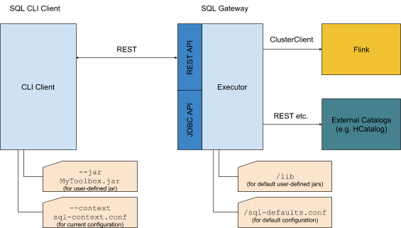
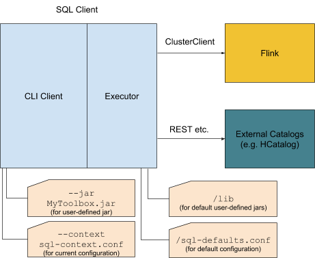

<https://cwiki.apache.org/confluence/display/FLINK/FLIP-24+-+SQL+Client>

# 解读

## 动机
SQL是一种易于理解并且被广泛使用于数据分析领域。SQL是申明式的同时能被大多数query引擎（处理器）优化和兼容。
将这些概念应用于流计算的必要性是使得流可以被更广泛的受众使用并且在没有底层运行时的精确知识的情况下实现更快的开发。

虽然 Flink的table & SQL API允许用户使用SQL语言申明查询语句。这个SQL查询需要被嵌入到一个flink table的程序（使用Java或者Scala开发）
在提交到集群上之前这个table程序需要使用maven打包。这样就限制了Flink Table&SQL API的使用群体只能主要是Java/Scala程序员。

长远来看，我们提提出这个SQL CLient想要到达的目标：

使Flink更加易用：make Flink accessible to non-programmers such as data scientists

开发flink任务不需要IDE和编译工具：allow to develop Flink applications without an IDE and without knowledge about Maven

标准的JDBC或者REST API 提交查询计划：make it possible to integrate other tools by submitting queries to Flink via JDBC or REST interfaces

即席查询：enable new use cases by offering job results via JDBC or REST interface and supplying regular result snapshots to dashboards

这个FLIP的目标是产生一个最小可行的产品使用Flink通过SQL而且不需要IDE. 我们将使用此产品根据用户和贡献者的反馈逐步完善需求。 
可以遵循进一步的FLIP和设计文档，以便定义REST / JDBC功能或物化视图语义。

## 公共接口层
A new Maven module “flink-sql-client” with the SQL client
A new binary file for executing the SQL client in embedded mode
New default configuration files and library directory

## 提议
### General Architecture
The SQL Client can be executed in two modes: a gateway and embedded mode. 
In this FLIP we mostly focus on the embedded mode but also consider a later gateway conceptually.

    + In gateway mode, a dedicated（专用的） SQL gateway process(进程) offers APIs to which other applications can connect to. 
        A REST API and JDBC API allow to submit queries, cancel jobs, and retrieve（取回） results. 
        Both REST and JDBC connect to a common executor that is responsible for communicating with Flink and external catalogs. 
        The executor also keeps state about currently running sessions. 
        The optional SQL CLI client connects to the REST API of the gateway and allows for managing queries via console.

    + In embedded mode, the SQL CLI is tightly coupled with the executor in a common process. 
    This allows for playing around with Flink quickly and submit jobs without having to start an additional components.

The communication to Flink happens through the ClusterClient. 
By using the ClusterClient we can ensure that the SQL client will run Flink on YARN, Mesos, and other supported environments without additional effort.

For the embedded mode, a general communication flow would like:

    + 数据表元信息写在配置文件里面：The user adds catalog information to the configuration files. 

    + 用户启动CLI通过jar文件或者配置文件：The user starts CLI client with custom JAR files and configuration (--jar, --context).

    + 用户输入SQL查询语句并提交：The user enters SQL query and submits it.

    + 执行者提价作业以及涉及到的所有jar文件：The executor submits Flink job with all involved JAR files.

    + 如果是SELECT查询，这个执行者将会物化查询结构，并拉去回来结果：If a query is a SELECT query, the executor materializes the result such that it can be pulled by the CLI client.

    + 如果是INSERT INTO查询，执行者将会提交作业：If a query is a INSERT INTO query, the executor submits the Flink job.
    
    + 用户可以停止正在执行的查询，并提交新的：The user can stop the running query and submit a new one.

    + 退出CLI，对于SELECT查询将会停止，但是INSERT INTO不会：Exiting the CLI would also stop the running SELECT query but not INSERT INTO queries.

Gateway Mode

Embedded Mode

## Configuration

Independent of the execution mode, the SQL client can be configured globally (sql-defaults.conf) and/or for every CLI session (sql-context.conf). 
The configuration specifies settings that would programmatically be applied to a ExecutionEnvironment/StreamExecutionEnvironment and TableEnvironment. 
It contains catalog information as well as(以及) job specific parameters.

The global configuration is located in a dedicated（专用的） file and is read during startup. 
Global configuration applies to all CLI sessions. 
A context configuration file can be specified when starting the CLI client and is attached to any query executed in the current CLI session. 
Thus（因此）, context properties might overwrite global default properties. 
In future versions, the configuration might also be refined by using DDL statements such as:

    CREATE TYPE...
    CREATE TABLE…
    SET PARALLELISM 23
    SET MIN_RETENTION 20000
    DECLARE @CustomerID = 'XYZ'
    
DDL statements will have highest priority and overwrite the properties specified in configuration files.

Here are some properties that might need to be defined in the long run:

+ Pre-registered table sources
    + Name
    + Source
        + Type (e.g. Kafka, Custom)
        + Properties (e.g. topic, connection info, custom TableSource class)
    
    Encoding
    
        Type (e.g. Avro, JSON)
        
        Schema (e.g. Avro class, JSON field names/types)
    
    Rowtime descriptor/Proctime
        
        Watermark strategy and Watermark properties
        
        Time attribute info
    
    Bucketization
    
    Statistics

+ Pre-registered table sinks

    Name
    
    Sink
    
        Type (e.g. Kafka, Custom)
        
        Properties (e.g. destination path, output types)

+ External catalogs

   Name

    Properties (e.g. connection info, credentials, ExternalCatalog class)

+ User-defined functions

    Name
    
    Parameters (e.g. constructor parameters for a TableFunction)
    
    Class

[Optional] User-defined types

    Name
    
    Field names and types

[Optional] User-defined local variables (@local_variable)
    
    Name
    
    Value

+ Job parameters
    
    Batch or streaming execution
    
    Parallelism
    
    Maximum parallelism
    
    State Backend + parameters
    
    Auto watermark interval
    
    Restart strategy
    
    Query Config (e.g. min/max retention time)

[Separate configuration?] SQL client parameters
    
    Gateway properties
    (e.g. database properties, server credentials)
    
    CLI Client properties
    (e.g. timeouts, credentials for authenticating to gateway, result serving speed)

## Result Retrieval（取回）
 
In the future, we can use different options for retrieving materialized results both for debugging purposes and long-running maintained views. 
The retrieval is managed by the executor.

There are three materialization modes:

 
    + Internal mode (for small results):
    collect() into Heap/Derby/... (we decide internally how this is done)
    We use DataSet/DataStream collect in order to retrieve results. They are materialized in the executor and deleted once pulled by the CLI client.

    + External mode (for larger results):
    automatic TableSink into Kafka, HDFS, DBMS, etc. (the content is accessible for the executor)
    Flink writes larger results into external systems by using pre-defined TableSinks. 
    The executor knows about the format and location and can access the information there. 

    + Custom mode (for any result):
    custom TableSink into arbitrary（任意的） systems
    Flink writes any result into a destination that is determined by the user using INSERT INTO. 
    The results are not accessible by the executor and can thus not be served via REST or CLI console.

The supported materialization mode also depends on the query type:

Query Type           Internal Mode             External Mode*
Batch          collect() -> Heap/Database      File table sink
Append Stream  collect() -> Heap/Database      Kafka/file table sink
Retract/Upsert Stream    collect() -> Heap/Database    (Compacted Kafka)/Cassandra table sink
 
We might use usual heap space at the beginning. The internal database can be any JDBC database. 
External materialization modes (*) are not included in the first version.
In the future, Kafka would be read by general Kafka utility functions. Files as well with support for different file systems.

## Result Maintenance
While batch queries have bounded results, streaming queries are potentially never-ending and, 
therefore, require special treatment for keeping the results up to date and consistent. 
The streaming query can be considered as a view and the running streaming application as the view maintenance. 
Results might need to be supplied to systems that were not made for streaming queries, 
e.g., Java applications that read from a JDBC API. In those cases, 
every requested result set must be a snapshot (materialized view) of the running query at a point in time. 
The snapshot must be immutable until all result rows have been consumed by the application or a new result set is requested. 
We distinguish between two types of results that will require different materialization semantics: a materialized view and a materialized result stream.

## Materialized View
A consistent materialized view of results for production use cases. 
Materialized views are not part of this FLIP but might be added in future versions. 
It requires another design document for the DDL statement and execution but here are some properties we aim for:

`SQL: CREATE MATERIALIZED VIEW ...`

    intended for long running materialization queries that are updated periodically (e.g. every hour or on successful checkpoints)
    
    retractions are not visible directly, only the materialized result
    
    a result can be accessed by JDBC connections or the REST API (e.g. for powering dashboards)
    
    materialization operators can cooperate with Flink's checkpointing (e.g. only checkpointed results are exposed through the APIs)
    
    a user can specify different parameters for how and how often the view is maintained
    (see create_mv_refresh)
    
    runs detached from the CLI client

## Materialized Result Stream
A materialized stream of results for getting immediate insights into the running SQL query.

`SQL: SELECT ...`

indended for debugging during query creation and initial show cases

retractions are shown as streams of deletion and insertion

no guarantees about checkpointed results

the executor abstracts the underlying representation and supplies the interfaces for accessing the materialized stream in a FIFO fashion

only one running query per CLI session

cancelled if cancelled in CLI or CLI is closed

We focus on simple SELECT queries first that are materialized on the heap of the executor (internal materialization mode).

## Compatibility, Deprecation, and Migration Plan

 No compatibility changes or other deprecation necessary.

## Implementation Plan
### 1. Basic Embedded SQL Client 
Add the basic features to play around with Flink's streaming SQL.

    Add CLI component that reads the configuration files
        "Pre-registered table sources"
        "Job parameters"
    Add executor for retrieving pre-flight information and corresponding CLI SQL parser
        SHOW TABLES
        DESCRIBE TABLE
        EXPLAIN
    Add streaming append query submission to executor
        Submit jars and run SELECT query using the ClusterClient
        Collect results on heap and serve them on the CLI side (Internal Mode with SELECT)
        EXECUTE (for executing a SQL statement stored in a local file)

### 2. Full Embedded SQL Client
Add important features to fully use the SQL client for a variety of use cases.
    
    Add support for streaming retract/upsert queries
    Add support for batch queries
    Add user-defined function support
    
        Support scalar, aggregate, and table functions
        Submit corresponding jars to the cluster
        DESCRIBE FUNCTION
    Add CLI query history
    Add CLI query code completion/highlighting
    Add support for INSERT INTO
    Read configuration about "Pre-registered table sinks"
    Allow submission without collect()

### 3. Discuss/design further features
Discuss and prioritize other features that are not part of this FLIP. 

    Introduce gateway mode with REST API
    
    Add support for catalogs
    
    Allow creating Materialized Views
    
    Support other materialization backends
    
    Create a JDBC API
    
    Further SQL DDL statements:
        CREATE TABLE
        CREATE TYPE

## Rejected Alternatives
If there are alternative ways of accomplishing the same thing, what were they? 
The purpose of this section is to motivate why the design is the way it is and not some other way.