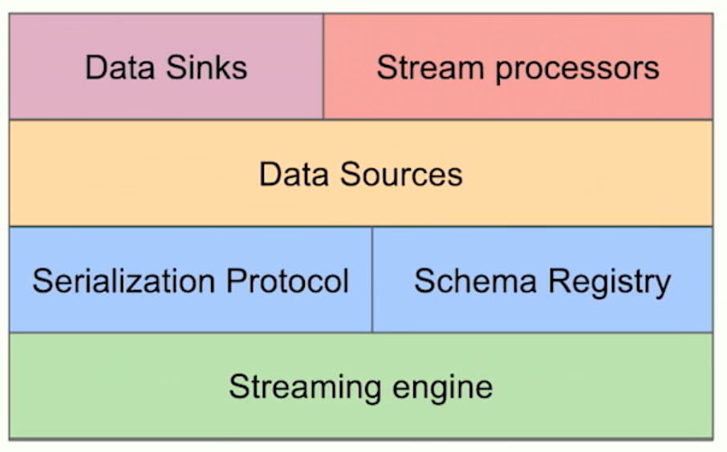
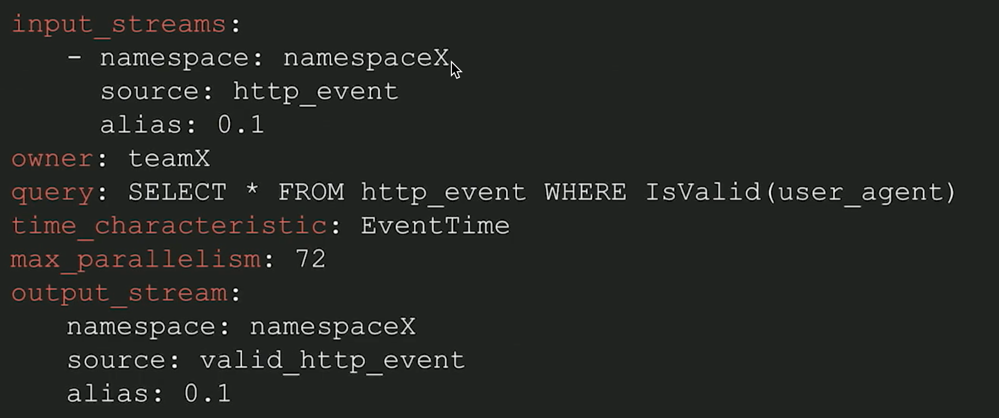
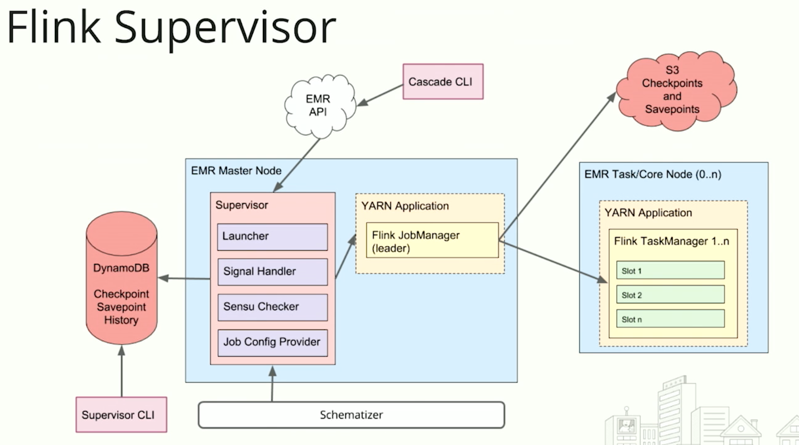

## Data pipeline stack

## Yelp'Data pipeline stack

### Data Sources
Log Event
+ Low latency
+ Unordered
+ High throughput
+ Highly partitioned
+ Can have data loss
+ Can have duplicates
web service -> flume -> kafka

Data store changelog
+ offline
+ globally ordered
+ low throughput
+ single compacted partition
+ exactly-once delivery
+ supports insert/update/delete operations

### Data transformation in Flink,  DSL

 data connector 
 审计接口、schema
## processing graph

## Flink Superivisor
